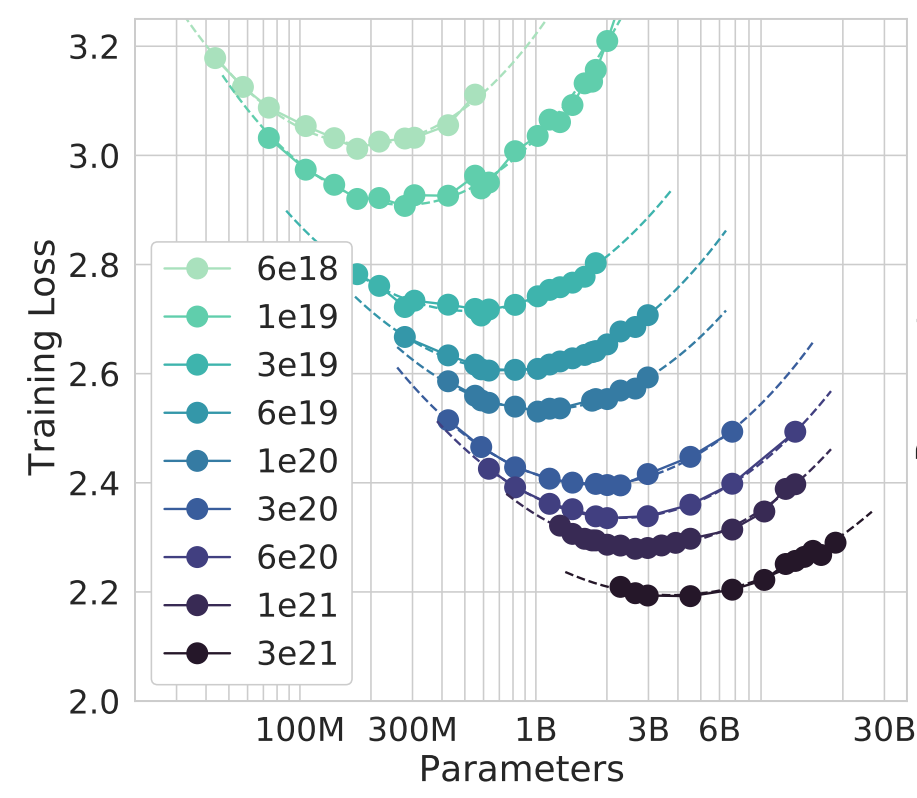

### How Much Data?

From the Chinchilla paper, one can note that the relation between model size and training loss is not correlated but rather associated. For each amount of compute (which translates to the amount of training data), the training loss shows a convex-shaped function, which means that for each amount of compute, there is an optimal model size, below or above which the training loss will be higher.

Based on these results, one can choose to sacrifice some loss reduction for the benefit of using a smaller model. In other words, for an amount of compute, you choose a model size that would result in a loss that is shifted to the left side of the curve.
